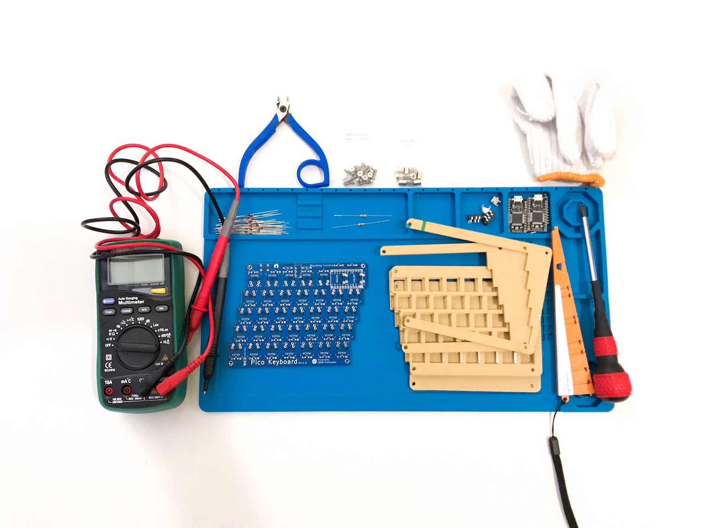

# Pico Keyboard Rev.1

Pico Keyboard は小さい手でも打鍵しやすいように設計された小型の分割キーボードです.  
スイッチのフットプリントは通常のCherry MX互換より一回り小さい [Kailh Mid-Height](http://www.kailh.com/en/Products/Ks/KHS/) を使っています。  

**English Manual is [here](README.md).**

<p align="center">

</p>


## Summary

  - [必要な部品](#必要な部品)
  - [組み立てガイド](#組み立てガイド)
  - [ファームウェア](#ファームウェア)
    - [基本書き込みコマンド](#基本書き込みコマンド)
    - [初回書き込み時](#初回書き込み時)
    - [JIS配列を書き込む場合](#JIS配列を書き込む場合)

## 必要な部品

| 数量 | 項目                                         | 備考                                                 |
|----:|----------------------------------------------|-----------------------------------------------------|
|   2 | Pico PCB                                     |                                                     |
|  65 | 1N4148 ダイオード                              | SMD ダイオードでも可.                                  |
|   2 | PJ-320A 4極 3.5mm TRRS コネクタ                |                                                     |
|   2 | 4.7 kΩ 抵抗                                   | 片側のPCBのみにはんだ付けします.                        |
|   2 | タクトスイッチ                                 | 6mm x 6mm x 4.3mm サイズのもの.                       |
|   2 | Arduino Pro Micro                            | マイコン: ATMega32U4                                  |
|   1 | TRRS ケーブル                                 | 4極のもの. (4極じゃないと正常動作しません)                 |
|   1 | USB micro ケーブル                            | 家に落ちているもので可.                                 |
|   2 | ケース                                        |                                                     |
|   8 | ネジ                                          | M3 のもの                                            |
|   8 | スペーサー                                     | M3 のもの                                            |
|   8 | ナット                                        | M3 のもの (オプション)                                 |
|  65 | [Kailh Mid-Height](http://www.kailh.com/en/Products/Ks/KHS/) | 茶・赤・青のいずれか                    |
|  65 | [Kailh Mid-Height](http://www.kailh.com/en/Products/Ks/KHS/) 互換 キーキャップ | 65 x 1u              |


## 組み立てガイド

<p align="center">

</p>


- PCBの `Mounting Surface` 側に下記をはんだ付けします:
  1. 1N4148ダイオード (向きがあります. カソードが四角型の穴側にくるように差します)<br/><div></div>
  2. PJ-320Aコネクタ
  3. タクトスイッチ
  4. 4.7 kΩ 抵抗 (左右どちらかのPCBのみにはんだ付けします)
  5. Pro Micro の ヘッダ・ピン (**Pro Micro 自身のはんだ付けはまだしません**).
- PCB に上部ケースを取り付けます.
  * M3ネジ(8mm) → 上部ケース → M3ナット → PCB → スペーサー の順番に取り付けます.<br/><div></div>
- スイッチを嵌めてはんだ付けします.
- Pro Micro を ヘッダ・ピンにはんだ付けします.<br/>
  Pro Micro が裏向き(チップ類がPCBに向くように)になるようにはんだ付けします.<br/><div></div>

## ファームウェア

<p align="center">

</p>

Pico Keyboard は [QMK Firmware](https://github.com/qmk/qmk_firmware) を利用しています.  
QMK Firmware のインストールは [こちら](https://docs.qmk.fm/#/newbs_getting_started) をご覧ください.  

### 基本書き込みコマンド

```sh
$ cd path/to/qmk_firmware
$ make pico/rev1:default:flash
```

### 初回書き込み時

初回書き込み時には、 左手・右手 両方の Pro Micro にファームを書く必要があります.  

#### 1. 左手側

[pico/config.h](https://github.com/qmk/qmk_firmware/blob/master/keyboards/pico/config.h) を編集して `MASTER_LEFT` を有効にします.

```cpp
/* Select hand configuration */
#define MASTER_LEFT
// #define MASTER_RIGHT
// #define EE_HANDS
```

保存したら、 **左手側** の Pro Micro と PC をUSBケーブルで接続し、 [基本書き込みコマンド](#基本書き込みコマンド) を実行します.

```sh
$ cd path/to/qmk_firmware
$ make pico/rev1:default:flash
```

#### 2. 右手側

[pico/config.h](https://github.com/qmk/qmk_firmware/blob/master/keyboards/pico/config.h) を編集して `MASTER_RIGHT` を有効にします.

```cpp
/* Select hand configuration */
// #define MASTER_LEFT
#define MASTER_RIGHT
// #define EE_HANDS
```

保存したら、**右手側** の Pro Micro と PC をUSBケーブルで接続し、 [基本書き込みコマンド](#基本書き込みコマンド) を実行します.


#### 3. 動作確認

一度USBケーブルを外してから、 TRRSケーブルで左右をつなぎます.  
マスター側の Pro Micro にUSBケーブルをつなぎ、左右ともに文字入力可能なことを確認します.　　

以降、キー配列を変更した場合など再びファームを書く場合は、 TRRSケーブルをつないだままマスター側の Pro Micro に書き込みを行うことで、左右に設定が反映されるようになります.　　


### JIS配列を書き込む場合

[qmk_firmware/keyboards/pico/keymaps/jis](https://github.com/qmk/qmk_firmware/blob/master/keyboards/pico/rev1/keymaps/jis/keymap.c) に JIS-like配列を置いていますが、[Qmk Firmware](https://github.com/qmk/qmk_firmware) の [keycodes](https://github.com/qmk/qmk_firmware/blob/master/docs/keycodes.md) を参考にご自身の使いやすいレイアウトに変更してお使いになられると良いかもしれません.  

```sh
$ cd path/to/qmk_firmware
$ make pico/rev1:jis:flash
```


## レイアウト

### デフォルト

<p align="center">

</p>

[KLE Layout permalink](http://www.keyboard-layout-editor.com/##@_name=pico-keyboard&author=x1%3Cviva008%2F@gmail.com%3E%3B&@=~%0A%0A%60&_f2:2%3B&=1%0AF1%0A!&=2%0AF2%0A%2F@&=3%0AF3%0A%23&=4%0AF4%0A$&=5%0AF5%0A%25&_x:3%3B&=6%0AF6%0A%5E&=7%0AF7%0A%2F&&=8%0AF8%0A*&=9%0AF9%0A(&=0%0AF10%0A)&=-%0AF11%0A%2F_&=%E2%86%90%0AF12%0Aback%3B&@_x:0.25%3B&=Tab&=Q&=W&=E&=R&=T&_x:3&f:3%3B&=Y%0A(&_f:3%3B&=U%0A)&_f:3%3B&=I%0A%7C&_f:3%3B&=O%0A*&_f:3%3B&=P%0A~&_f:3%3B&=%5B%0A%C2%A5%0A%7B&_f:3%3B&=%5D%0A%5C%0A%7D%3B&@_x:0.5%3B&=Ctrl&=A&=S&=D&=F&=G&_x:3&f:3%3B&=H%0A%5B&_f:3%3B&=J%0A%5D&_f:3%3B&=K%0A.&_f:3%3B&=L%0A%2F%2F&_f:3%3B&=%2F%3B%0A%60%0A%2F:&_f:3%3B&='%0A-%0A%22&=Enter%3B&@_x:0.75%3B&=Shift&=Z&=X&=C&=V&=B&_x:3&f:3%3B&=N%0A%7B&_f:3%3B&=M%0A%7D&_f:3%3B&=,%0A%0A%3C&_f:3%3B&=.%0A%0A%3E&_f:3%3B&=%2F%2F%0A%0A%3F&_f:3%3B&=%E2%86%91%0A%5E&=Shift%3B&@_x:1&f:3%3B&=Alt%0A%0A%0AEsc&=Enter&=Del&=GUI&_fa@:2&:2%3B%3B&=LANG2%0Alayer&_f:3%3B&=Space&_x:3&f:3%3B&=Space&=LANG1%0Alayer&_f:3%3B&=GUI&_f:3%3B&=Del&_f:3%3B&=%E2%86%90%0A%3C&_f:3%3B&=%E2%86%93%0A%2F_&_f:3%3B&=%E2%86%92%0A%3E)

### JIS-like 配列

<p align="center">

</p>

[KLE Layout permalink](http://www.keyboard-layout-editor.com/##@_name=pico-keyboard%20JIS-like&author=x1%3Cviva008%2F@gmail.com%3E%3B&@=Esc&_f2:2%3B&=1%0AF1%0A!&=2%0AF2%0A%22&=3%0AF3%0A%23&=4%0AF4%0A$&=5%0AF5%0A%25&_x:3%3B&=6%0AF6%0A%2F&&=7%0AF7%0A'&=8%0AF8%0A(&=9%0AF9%0A)&=0%0AF10&=-%0AF11%0A%2F=&=%E2%86%90%0AF12%0Aback%3B&@_x:0.25%3B&=Tab&=Q&=W&=E&=R&=T&_x:3&f:3%3B&=Y%0A(&_f:3%3B&=U%0A)&_f:3%3B&=I%0A%7C&_f:3%3B&=O%0A%C2%A5&_f:3%3B&=P%0A~&_f:3%3B&=%2F@%0A%0A%60&_f:3%3B&=%5E%0A%0A~%3B&@_x:0.5%3B&=Ctrl&=A&=S&=D&=F&=G&_x:3&f:3%3B&=H%0A%5B&_f:3%3B&=J%0A%5D&_f:3%3B&=K%0A.&_f:3%3B&=L%0A%2F%2F&_f:3%3B&=%2F%3B%0A%60%0A+&_f:3%3B&=%2F:%0A-%0A*&=Enter%3B&@_x:0.75%3B&=Shift&=Z&=X&=C&=V&=B&_x:3&f:3%3B&=N%0A%7B&_f:3%3B&=M%0A%7D&_f:3%3B&=,%0A%0A%3C&_f:3%3B&=.%0A%0A%3E&_f:3%3B&=%2F%2F%0A%0A%3F&_f:3%3B&=%E2%86%91%0A%2F_&=Layer%3B&@_x:1&f:3%3B&=Alt%0A%0A%0AEsc&=Enter&=Del&=GUI&_fa@:2&:2%3B%3B&=LANG2%0Alayer&_f:3%3B&=Space&_x:3&f:3%3B&=Space&=LANG1%0Alayer&_f:3%3B&=GUI&_f:3%3B&=Del&_f:3%3B&=%E2%86%90%0A%3C&_f:3%3B&=%E2%86%93&_f:3%3B&=%E2%86%92%0A%3E)


