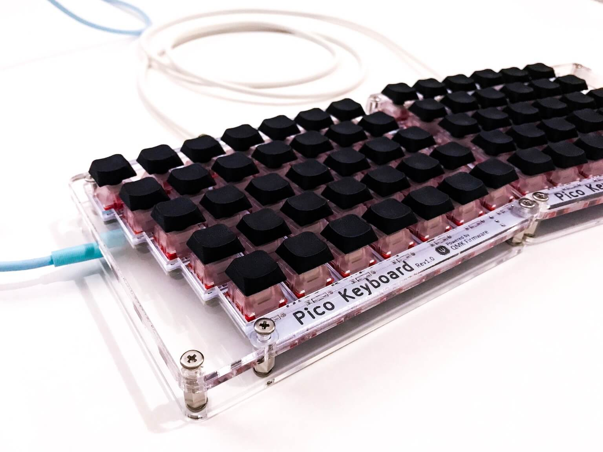
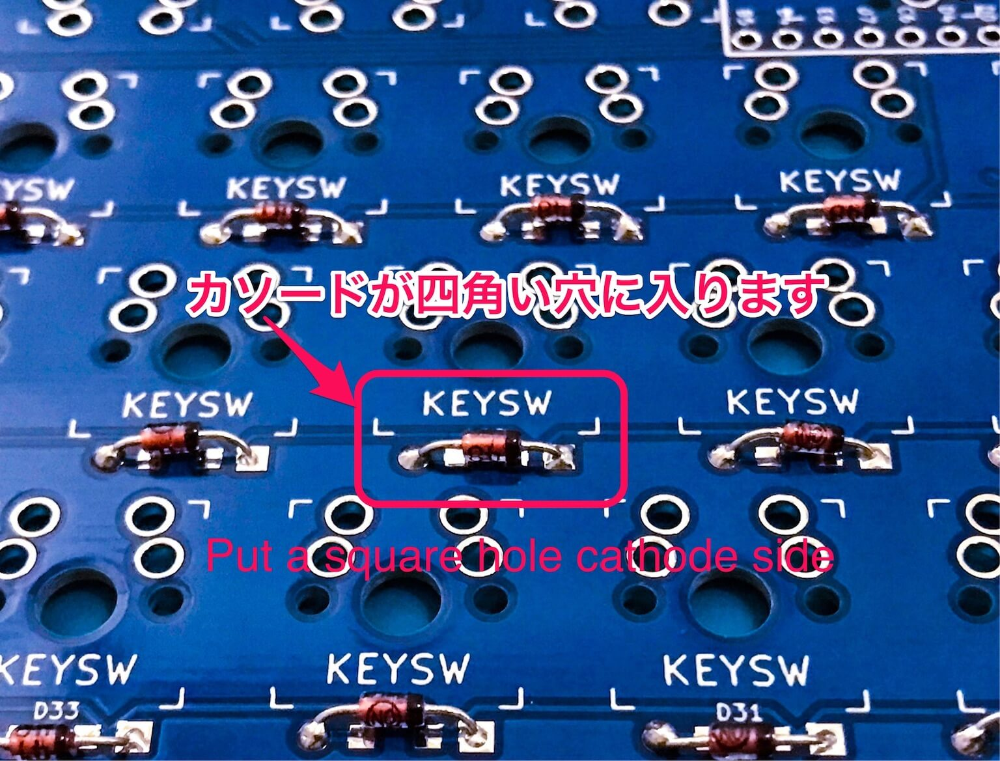
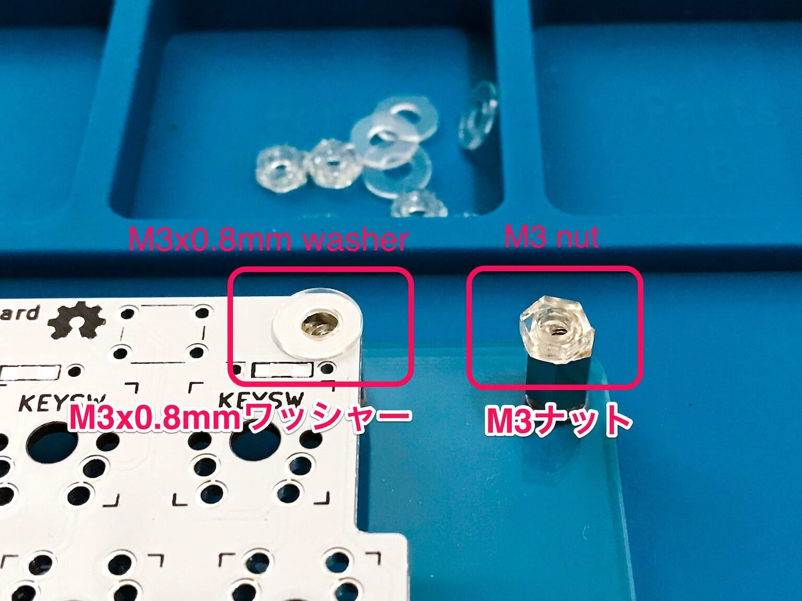
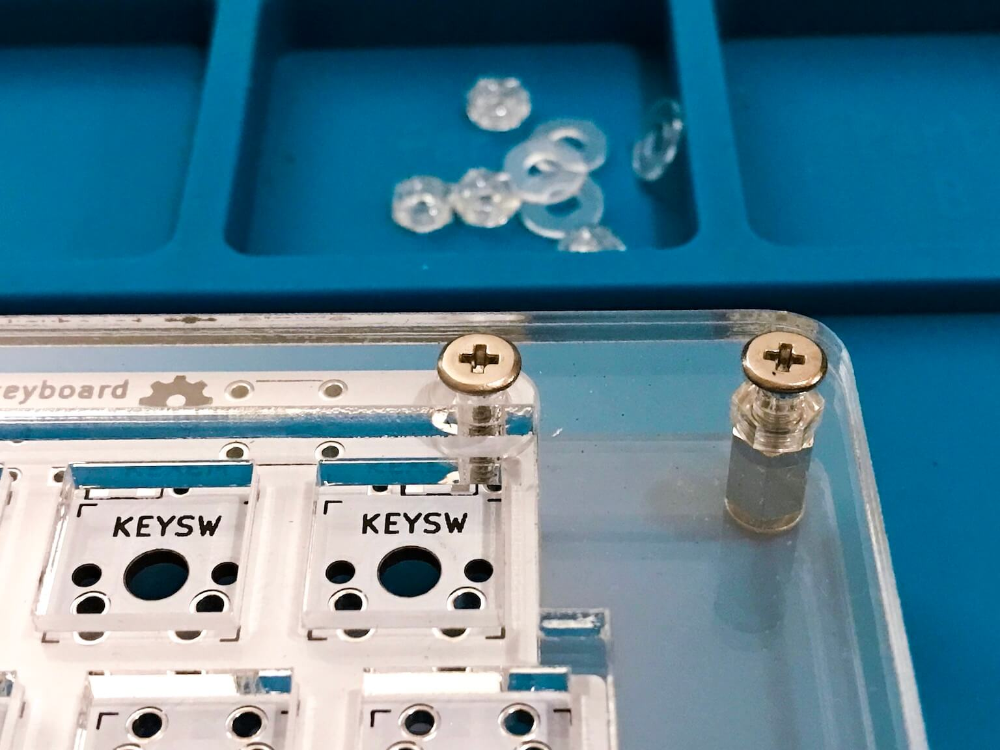
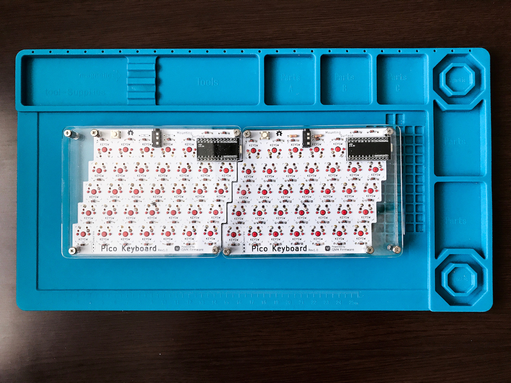
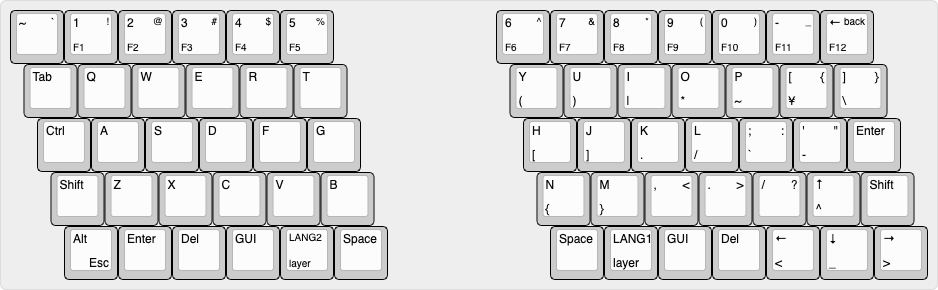
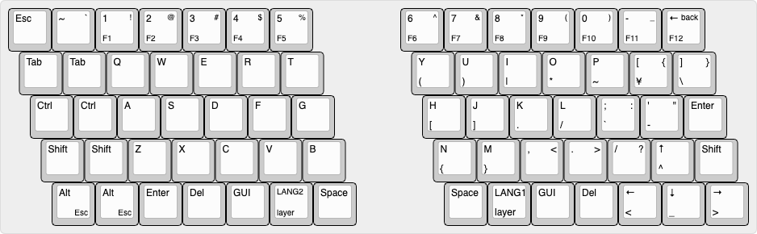
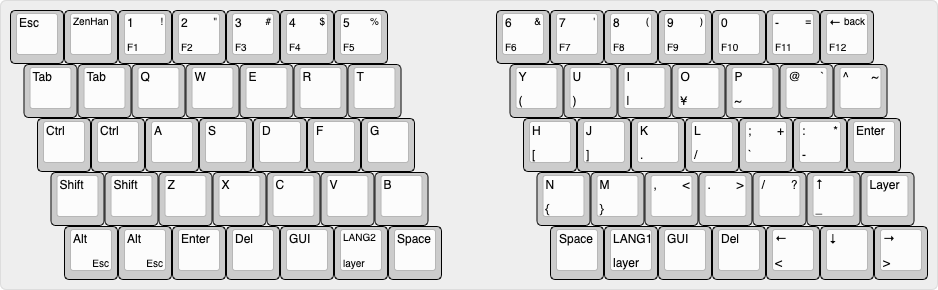

# Pico Keyboard Rev.1

Pico Keyboard は小さい手でも打鍵しやすいように設計された小型の分割キーボードです.  
スイッチのフットプリントは通常のCherry MX互換より一回り小さい [Kailh Mid-Height](http://www.kailh.com/en/Products/Ks/KHS/) を使っています。  

**English Manual is [here](README.md).**

<div style="display:block;margin:50px auto;">
<p align="center">


</p>
</div>


## Summary

  - [必要な部品](#必要な部品)
  - [組み立てガイド](#組み立てガイド)
  - [ファームウェア](#ファームウェア)
    - [基本書き込みコマンド](#基本書き込みコマンド)
    - [初回書き込み時](#初回書き込み時)
    - [JIS配列を書き込む場合](#JIS配列を書き込む場合)
    - [70キー用キーマップを書き込む場合](#70キー用キーマップを書き込む場合)

## 必要な部品

| 数量 | 項目                                         | 備考                                                 |
|----:|----------------------------------------------|-----------------------------------------------------|
|   2 | Pico PCB                                     |                                                     |
|  65 | 1N4148 ダイオード                              | SMD ダイオードでも可.                                  |
|   2 | PJ-320A 4極 3.5mm TRRS コネクタ                |                                                     |
|   2 | 4.7 kΩ 抵抗                                   | 片側のPCBのみにはんだ付けします.                        |
|   2 | タクトスイッチ                                 | 6mm x 6mm x 4.3mm サイズのもの.                       |
|   2 | Arduino Pro Micro                            | マイコン: ATMega32U4                                  |
|   1 | TRRS ケーブル                                 | 4極のもの. (4極じゃないと正常動作しません)                 |
|   1 | USB micro ケーブル                            | 家に落ちているもので可.                                 |
|   2 | ケース                                        |                                                     |
|  10 | ネジ M3 x 5                                   | M3 のもの                                            |
|  10 | ネジ M3 x 10                                  | ケースの厚み次第で M3 x 12 や M3 x15                    |
|  10 | スペーサー                                     | M3 のもの                                            |
|   8 | ワッシャー                                     | M3 厚さ 0.8mm                                        |
|   2 | ナット                                        | M3 厚さ 2.4mm                                        |
|  65 | [Kailh Mid-Height](http://www.kailh.com/en/Products/Ks/KHS/) | 茶・赤・青のいずれか                    |
|  65 | [Kailh Mid-Height](http://www.kailh.com/en/Products/Ks/KHS/) 互換 キーキャップ | 65 x 1u              |

> Pico Keyboard は 70キーのキーボードとして組み立てることもできます.  
> その場合には、 1N4148 ダイオード, スイッチ, キーキャップがそれぞれ 70個づつ必要になります.


キーキャップとスイッチ以外の全てを含む [Pico rev1 基本セット](https://kumaokobo.booth.pm/items/1707764) を [BOOTH](https://kumaokobo.booth.pm/) にて販売しています.  

[Kailh Mid-Height](http://www.kailh.com/en/Products/Ks/KHS/) に適合するキーキャップを mulgray さんが 作成してくれました 🎉 
DMM.make クリエイターズマーケットにて販売中です.
- [DMM.make > ミニキーキャップ 72個](https://make.dmm.com/item/1125390/)<div></div>


## 組み立てガイド

<p align="center">

</p>


- PCBの `Mounting Surface` 側に下記をはんだ付けします:
  1. 1N4148ダイオード (向きがあります. カソードが四角型の穴側にくるように差します)<br/><div></div>
  2. PJ-320Aコネクタ
  3. タクトスイッチ
  4. 4.7 kΩ 抵抗 (左右どちらかのPCBのみにはんだ付けします)
  5. Pro Micro の ピン・ヘッダ (**Pro Micro 自身のはんだ付けはまだしません**).
- `Mounting Surface` の裏側から出ているパーツの足をカットします.  
※ 特にタクトスイッチ, 抵抗, PJ-320Aコネクタ, Pro MicroのRaw部分はケースに干渉しやすいので、できるだけ短く切ってください.  
- ケース中部(スイッチ穴のあるもの)にスイッチを嵌め、PCBにスイッチの足が合うようにセットします.
- このままでははんだ付けがし難いので、ケース上部(コの字型のもの)側から,  
M3ネジ(10mm) → ケース上部 → ケース中部 → ワッシャー → PCB → スペーサー の順番にとめます.<br/><div>
  <span>&nbsp;</span>
  </div>
  PCBが乗らない部分のスペーサーにはM3ナットを嵌めて高さを調整します.
- スイッチをはんだ付けします.
- Pro Micro を ピン・ヘッダにはんだ付けします.<br/>
  Pro Micro が裏向き(チップ類がPCBに向くように)になるようにはんだ付けします.  <br/><div></div>*※ 左右どちらとも裏向きです*
- ケース下部(一番面積の大きいもの)を M3ネジ(5mm) で取り付けて完成です.

## ファームウェア

<p align="center">

</p>

Pico Keyboard は [QMK Firmware](https://github.com/qmk/qmk_firmware) を利用しています.  
QMK Firmware のインストールは [こちら](https://docs.qmk.fm/#/newbs_getting_started) をご覧ください.  

### 基本書き込みコマンド

```sh
$ cd path/to/qmk_firmware
$ make pico/65keys:default:flash
```

※ 70キー用にキーマップを書き込む場合は、 [70キー用キーマップを書き込む場合](#70キー用キーマップを書き込む場合) をご覧ください.  


### 初回書き込み時

初回書き込み時には、 左手・右手 両方の Pro Micro にファームを書く必要があります.  

#### 1. 左手側

[pico/config.h](https://github.com/qmk/qmk_firmware/blob/master/keyboards/pico/config.h) を編集して `MASTER_LEFT` を有効にします.

```cpp
/* Select hand configuration */
#define MASTER_LEFT
// #define MASTER_RIGHT
// #define EE_HANDS
```

保存したら、 **左手側** の Pro Micro と PC をUSBケーブルで接続し、 [基本書き込みコマンド](#基本書き込みコマンド) を実行します.

```sh
$ cd path/to/qmk_firmware
$ make pico/65keys:default:flash
```

#### 2. 右手側

[pico/config.h](https://github.com/qmk/qmk_firmware/blob/master/keyboards/pico/config.h) を編集して `MASTER_RIGHT` を有効にします.

```cpp
/* Select hand configuration */
// #define MASTER_LEFT
#define MASTER_RIGHT
// #define EE_HANDS
```

保存したら、**右手側** の Pro Micro と PC をUSBケーブルで接続し、 [基本書き込みコマンド](#基本書き込みコマンド) を実行します.


#### 3. 動作確認

一度USBケーブルを外してから、 TRRSケーブルで左右をつなぎます.  
マスター側の Pro Micro にUSBケーブルをつなぎ、左右ともに文字入力可能なことを確認します.　　

以降、キー配列を変更した場合など再びファームを書く場合は、 TRRSケーブルをつないだままマスター側の Pro Micro に書き込みを行うことで、左右に設定が反映されるようになります.　　


### JIS配列を書き込む場合

[pico/65keys/keymaps/jis](https://github.com/qmk/qmk_firmware/blob/master/keyboards/pico/65keys/keymaps/jis/keymap.c) に JIS-like配列を置いていますが、[Qmk Firmware](https://github.com/qmk/qmk_firmware) の [keycodes](https://github.com/qmk/qmk_firmware/blob/master/docs/keycodes.md) を参考にご自身の使いやすいレイアウトに変更してお使いになられると良いかもしれません.  

```sh
$ cd path/to/qmk_firmware
$ make pico/65keys:jis:flash
```

### 70キー用キーマップを書き込む場合

`65keys` の箇所を `70keys` に変更して上記1.〜3.を実行します.  
※ JIS-like配列 は [pico/70keys/keymaps/jis](https://github.com/qmk/qmk_firmware/blob/master/keyboards/pico/70keys/keymaps/jis/keymap.c) をご覧ください.  

```sh
$ cd path/to/qmk_firmware
$ make pico/70keys:default:flash
```


## レイアウト

<em><a href="http://www.keyboard-layout-editor.com/">http://www.keyboard-layout-editor.com/</a></em>

### 65キー デフォルト

<p align="center">

</p>

[KLE Layout permalink](http://www.keyboard-layout-editor.com/##@_name=pico-keyboard%2065%20keys&author=kumaokobo%3Ckumaokobo%2F@gmail.com%3E%3B&@=~%0A%0A%60&_f2:2%3B&=1%0AF1%0A!&=2%0AF2%0A%2F@&=3%0AF3%0A%23&=4%0AF4%0A$&=5%0AF5%0A%25&_x:3%3B&=6%0AF6%0A%5E&=7%0AF7%0A%2F&&=8%0AF8%0A*&=9%0AF9%0A(&=0%0AF10%0A)&=-%0AF11%0A%2F_&=%E2%86%90%0AF12%0Aback%3B&@_x:0.25%3B&=Tab&=Q&=W&=E&=R&=T&_x:3&f:3%3B&=Y%0A(&_f:3%3B&=U%0A)&_f:3%3B&=I%0A%7C&_f:3%3B&=O%0A*&_f:3%3B&=P%0A~&_f:3%3B&=%5B%0A%C2%A5%0A%7B&_f:3%3B&=%5D%0A%5C%0A%7D%3B&@_x:0.5%3B&=Ctrl&=A&=S&=D&=F&=G&_x:3&f:3%3B&=H%0A%5B&_f:3%3B&=J%0A%5D&_f:3%3B&=K%0A.&_f:3%3B&=L%0A%2F%2F&_f:3%3B&=%2F%3B%0A%60%0A%2F:&_f:3%3B&='%0A-%0A%22&=Enter%3B&@_x:0.75%3B&=Shift&=Z&=X&=C&=V&=B&_x:3&f:3%3B&=N%0A%7B&_f:3%3B&=M%0A%7D&_f:3%3B&=,%0A%0A%3C&_f:3%3B&=.%0A%0A%3E&_f:3%3B&=%2F%2F%0A%0A%3F&_f:3%3B&=%E2%86%91%0A%5E&=Shift%3B&@_x:1&f:3%3B&=Alt%0A%0A%0AEsc&=Enter&=Del&=GUI&_fa@:2&:2%3B%3B&=LANG2%0Alayer&_f:3%3B&=Space&_x:3&f:3%3B&=Space&_f:3%3B&=LANG1%0Alayer&_f:3%3B&=GUI&_f:3%3B&=Del&_f:3%3B&=%E2%86%90%0A%3C&_f:3%3B&=%E2%86%93%0A%2F_&_f:3%3B&=%E2%86%92%0A%3E)

### 70キー デフォルト

<p align="center">

</p>

[KLE Layout permalink](http://www.keyboard-layout-editor.com/##@_name=pico-keyboard%2070%20keys&author=kumaokobo%3Ckumaokobo%2F@gmail.com%3E%3B&@=Esc&=~%0A%0A%60&_f2:2%3B&=1%0AF1%0A!&=2%0AF2%0A%2F@&=3%0AF3%0A%23&=4%0AF4%0A$&=5%0AF5%0A%25&_x:2%3B&=6%0AF6%0A%5E&=7%0AF7%0A%2F&&=8%0AF8%0A*&=9%0AF9%0A(&=0%0AF10%0A)&=-%0AF11%0A%2F_&=%E2%86%90%0AF12%0Aback%3B&@_x:0.25%3B&=Tab&=Tab&=Q&=W&=E&=R&=T&_x:2&f:3%3B&=Y%0A(&_f:3%3B&=U%0A)&_f:3%3B&=I%0A%7C&_f:3%3B&=O%0A*&_f:3%3B&=P%0A~&_f:3%3B&=%5B%0A%C2%A5%0A%7B&_f:3%3B&=%5D%0A%5C%0A%7D%3B&@_x:0.5%3B&=Ctrl&=Ctrl&=A&=S&=D&=F&=G&_x:2&f:3%3B&=H%0A%5B&_f:3%3B&=J%0A%5D&_f:3%3B&=K%0A.&_f:3%3B&=L%0A%2F%2F&_f:3%3B&=%2F%3B%0A%60%0A%2F:&_f:3%3B&='%0A-%0A%22&=Enter%3B&@_x:0.75%3B&=Shift&=Shift&=Z&=X&=C&=V&=B&_x:2&f:3%3B&=N%0A%7B&_f:3%3B&=M%0A%7D&_f:3%3B&=,%0A%0A%3C&_f:3%3B&=.%0A%0A%3E&_f:3%3B&=%2F%2F%0A%0A%3F&_f:3%3B&=%E2%86%91%0A%5E&=Shift%3B&@_x:1%3B&=Alt%0A%0A%0AEsc&=Alt%0A%0A%0AEsc&=Enter&=Del&=GUI&_fa@:2&:2%3B%3B&=LANG2%0Alayer&_f:3%3B&=Space&_x:2&f:3%3B&=Space&_f:3%3B&=LANG1%0Alayer&_f:3%3B&=GUI&_f:3%3B&=Del&_f:3%3B&=%E2%86%90%0A%3C&_f:3%3B&=%E2%86%93%0A%2F_&_f:3%3B&=%E2%86%92%0A%3E)


### 65キー JIS-like 配列

<p align="center">

</p>

[KLE Layout permalink](http://www.keyboard-layout-editor.com/##@_name=pico-keyboard%20JIS-like%2065%20keys&author=kumaokobo%3Ckumaokobo%2F@gmail.com%3E%3B&@=Esc&_f2:2%3B&=1%0AF1%0A!&=2%0AF2%0A%22&=3%0AF3%0A%23&=4%0AF4%0A$&=5%0AF5%0A%25&_x:3%3B&=6%0AF6%0A%2F&&=7%0AF7%0A'&=8%0AF8%0A(&=9%0AF9%0A)&=0%0AF10&=-%0AF11%0A%2F=&=%E2%86%90%0AF12%0Aback%3B&@_x:0.25%3B&=Tab&=Q&=W&=E&=R&=T&_x:3&f:3%3B&=Y%0A(&_f:3%3B&=U%0A)&_f:3%3B&=I%0A%7C&_f:3%3B&=O%0A%C2%A5&_f:3%3B&=P%0A~&_f:3%3B&=%2F@%0A%0A%60&_f:3%3B&=%5E%0A%0A~%3B&@_x:0.5%3B&=Ctrl&=A&=S&=D&=F&=G&_x:3&f:3%3B&=H%0A%5B&_f:3%3B&=J%0A%5D&_f:3%3B&=K%0A.&_f:3%3B&=L%0A%2F%2F&_f:3%3B&=%2F%3B%0A%60%0A+&_f:3%3B&=%2F:%0A-%0A*&=Enter%3B&@_x:0.75%3B&=Shift&=Z&=X&=C&=V&=B&_x:3&f:3%3B&=N%0A%7B&_f:3%3B&=M%0A%7D&_f:3%3B&=,%0A%0A%3C&_f:3%3B&=.%0A%0A%3E&_f:3%3B&=%2F%2F%0A%0A%3F&_f:3%3B&=%E2%86%91%0A%2F_&=Layer%3B&@_x:1&f:3%3B&=Alt%0A%0A%0AEsc&=Enter&=Del&=GUI&_fa@:2&:2%3B%3B&=LANG2%0Alayer&_f:3%3B&=Space&_x:3&f:3%3B&=Space&_f:3%3B&=LANG1%0Alayer&_f:3%3B&=GUI&_f:3%3B&=Del&_f:3%3B&=%E2%86%90%0A%3C&_f:3%3B&=%E2%86%93&_f:3%3B&=%E2%86%92%0A%3E)


### 70キー JIS-like 配列

<p align="center">

</p>

[KLE Layout permalink](http://www.keyboard-layout-editor.com/##@_name=pico-keyboard%20JIS-like%2070%20keys&author=kumaokobo%3Ckumaokobo%2F@gmail.com%3E%3B&@=Esc&_fa@:2%3B%3B&=ZenHan&_f2:2%3B&=1%0AF1%0A!&=2%0AF2%0A%22&=3%0AF3%0A%23&=4%0AF4%0A$&=5%0AF5%0A%25&_x:2%3B&=6%0AF6%0A%2F&&=7%0AF7%0A'&=8%0AF8%0A(&=9%0AF9%0A)&=0%0AF10&=-%0AF11%0A%2F=&=%E2%86%90%0AF12%0Aback%3B&@_x:0.25%3B&=Tab&=Tab&=Q&=W&=E&=R&=T&_x:2&f:3%3B&=Y%0A(&_f:3%3B&=U%0A)&_f:3%3B&=I%0A%7C&_f:3%3B&=O%0A%C2%A5&_f:3%3B&=P%0A~&_f:3%3B&=%2F@%0A%0A%60&_f:3%3B&=%5E%0A%0A~%3B&@_x:0.5%3B&=Ctrl&=Ctrl&=A&=S&=D&=F&=G&_x:2&f:3%3B&=H%0A%5B&_f:3%3B&=J%0A%5D&_f:3%3B&=K%0A.&_f:3%3B&=L%0A%2F%2F&_f:3%3B&=%2F%3B%0A%60%0A+&_f:3%3B&=%2F:%0A-%0A*&=Enter%3B&@_x:0.75%3B&=Shift&=Shift&=Z&=X&=C&=V&=B&_x:2&f:3%3B&=N%0A%7B&_f:3%3B&=M%0A%7D&_f:3%3B&=,%0A%0A%3C&_f:3%3B&=.%0A%0A%3E&_f:3%3B&=%2F%2F%0A%0A%3F&_f:3%3B&=%E2%86%91%0A%2F_&=Layer%3B&@_x:1%3B&=Alt%0A%0A%0AEsc&=Alt%0A%0A%0AEsc&=Enter&=Del&=GUI&_fa@:2&:2%3B%3B&=LANG2%0Alayer&_f:3%3B&=Space&_x:2&f:3%3B&=Space&_f:3%3B&=LANG1%0Alayer&_f:3%3B&=GUI&_f:3%3B&=Del&_f:3%3B&=%E2%86%90%0A%3C&_f:3%3B&=%E2%86%93&_f:3%3B&=%E2%86%92%0A%3E)


