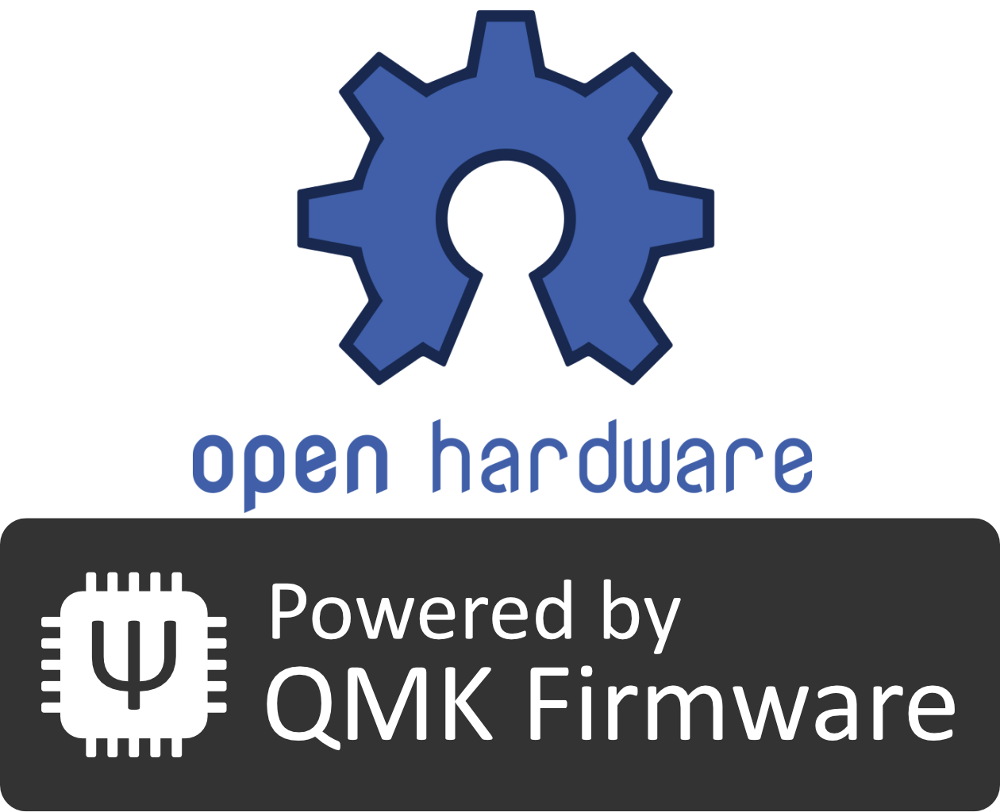

# Pico Keyboard Rev.1

Pico Keyboard is designed for small hands.  
It adopted the footprint for [Kailh Mid-Height](http://www.kailh.com/en/Products/Ks/KHS/) smaller than Cherry MX compatible switches.  

**Japanese Manual is [here](README.ja.md).**

<p align="center">

</p>

## Summary

  - [Bill of materials](#bill-of-materials)
  - [Assembly guide](#assembly-guide)
  - [Firmware](#firmware)
    - [Basic compiling and burning command](#basic-compiling-and-burning-command)
    - [First time burning](#first-time-burning)

## Bill of materials

| Qty | Item                                          | Notes                                               |
|----:|-----------------------------------------------|-----------------------------------------------------|
|   2 | Pico PCBs                                     |                                                     |
|  65 | 1N4148 diodes                                 | SMD diodes can also be used                         |
|   2 | PJ-320A 4 poles 3.5 mm TRRS connectors        |                                                     |
|   2 | 4.7 kΩ resistors                              | Need to be soldered on one half only                |
|   2 | Through hole momentary switch                 | Dimensions 6mm x 6mm x 4.3mm                        |
|   2 | Arduino Pro Micro compatible microcontrollers | ATMega32U4                                          |
|   1 | TRRS cable                                    |                                                     |
|   1 | USB micro cable                               |                                                     |
|   2 | Cases                                         |                                                     |
|   8 | Screws                                        | M3                                                  |
|   8 | Spacers                                       | M3                                                  |
|   8 | Nuts                                          | M3                                                  |
|  65 | [Kailh Mid-Height](http://www.kailh.com/en/Products/Ks/KHS/) | Brown, Red or Blue.                  |
|  65 | [Kailh Mid-Height](http://www.kailh.com/en/Products/Ks/KHS/) compatible keycaps | 65x 1u keycaps    |


## Assembly guide

<p align="center">

</p>

### Installation steps:

- Solder components:
  1. Solder 1N4148 diodes. Keep the diode legs for the right hand controller installation.<br/><div></div>
  2. Solder PJ-320A connectors.
  3. Solder momentary switches.
  4. Solder 4.7 kΩ resistors **on one half only**.
  5. Solder the Pro Micro header pins (**do not solder the Pro Micro controllers yet**).
- Install upper cases to PCBs.
  * M3x8 screws → upper case → M3 nuts → PCB → spacers.<br/><div></div>
- Fit switches to the upper cases and solder to the PCB.
- Solder Pro Micros to the header pins.
  * Solder Pro Micro face down.<br/><div>
  </div>


## Firmware

<p align="center">

</p>

Pico keyboard uses [QMK Firmware](https://github.com/qmk/qmk_firmware) for its firmware.  
Follow the QMK installation instructions [here](https://docs.qmk.fm/#/newbs_getting_started), then compile and burn the firmware as follows:  

### Basic compiling and burning command

```sh
$ cd path/to/qmk_firmware
$ make pico/rev1:default:flash
```

### First time burning

You need to burn the firmware both left hand and right hand.


#### 1. Left hand side

Edit [pico/config.h](https://github.com/qmk/qmk_firmware/blob/master/keyboards/pico/config.h) and activate `MASTER_LEFT` .

```cpp
/* Select hand configuration */
#define MASTER_LEFT
// #define MASTER_RIGHT
// #define EE_HANDS
```

Save the file, then connect Pro Micro(**left hand**) and your PC by USB cable.  
Compile and burn the firmware by running [Basic compiling and burning command](#basic-compiling-and-burning-command) as follows:  

```sh
$ cd path/to/qmk_firmware
$ make pico/rev1:default:flash
```

#### 2. Right hand side

Edit [pico/config.h](https://github.com/qmk/qmk_firmware/blob/master/keyboards/pico/config.h) and activate `MASTER_RIGHT` .  

```cpp
/* Select hand configuration */
// #define MASTER_LEFT
#define MASTER_RIGHT
// #define EE_HANDS
```

Save the file, then connect Pro Micro(**right hand**) and your PC by USB cable.  
Compile and burn the firmware by running [Basic compiling and burning command](#basic-compiling-and-burning-command).  

#### 3. Confirmation

Pull out the USB cable, then connect left hand and right hand by TRRS cable.  
Plug in the Pro Micro (Master) the USB cable.  

## Layout

<p align="center">

</p>

[KLE Layout permalink](http://www.keyboard-layout-editor.com/##@_name=pico-keyboard&author=x1%3Cviva008%2F@gmail.com%3E%3B&@=~%0A%0A%60&_f2:2%3B&=1%0AF1%0A!&=2%0AF2%0A%2F@&=3%0AF3%0A%23&=4%0AF4%0A$&=5%0AF5%0A%25&_x:3%3B&=6%0AF6%0A%5E&=7%0AF7%0A%2F&&=8%0AF8%0A*&=9%0AF9%0A(&=0%0AF10%0A)&=-%0AF11%0A%2F_&=%E2%86%90%0AF12%0Aback%3B&@_x:0.25%3B&=Tab&=Q&=W&=E&=R&=T&_x:3&f:3%3B&=Y%0A(&_f:3%3B&=U%0A)&_f:3%3B&=I%0A%7C&_f:3%3B&=O%0A*&_f:3%3B&=P%0A~&_f:3%3B&=%5B%0A%C2%A5%0A%7B&_f:3%3B&=%5D%0A%5C%0A%7D%3B&@_x:0.5%3B&=Ctrl&=A&=S&=D&=F&=G&_x:3&f:3%3B&=H%0A%5B&_f:3%3B&=J%0A%5D&_f:3%3B&=K%0A.&_f:3%3B&=L%0A%2F%2F&_f:3%3B&=%2F%3B%0A%60%0A%2F:&_f:3%3B&='%0A-%0A%22&=Enter%3B&@_x:0.75%3B&=Shift&=Z&=X&=C&=V&=B&_x:3&f:3%3B&=N%0A%7B&_f:3%3B&=M%0A%7D&_f:3%3B&=,%0A%0A%3C&_f:3%3B&=.%0A%0A%3E&_f:3%3B&=%2F%2F%0A%0A%3F&_f:3%3B&=%E2%86%91%0A%5E&=Shift%3B&@_x:1&f:3%3B&=Alt%0A%0A%0AEsc&=Enter&=Del&=GUI&_fa@:2&:2%3B%3B&=LANG2%0Alayer&_f:3%3B&=Space&_x:3&f:3%3B&=Space&=LANG1%0Alayer&_f:3%3B&=GUI&_f:3%3B&=Del&_f:3%3B&=%E2%86%90%0A%3C&_f:3%3B&=%E2%86%93%0A%2F_&_f:3%3B&=%E2%86%92%0A%3E)
